# Token Factory

The Token Factory module allows any account or smart contract to create new tokens in a permissionless manner, following the format:
```
coin.{creator_address}.{subdenom}
```

Tokens are namespaced by the creator's address, ensuring unique denominations without collisions.

This guarantees that:
- Each user can create one token per **subdenom** directly via RPC or contract interface.
- Each CosmWasm factory contract can create unique tokens.

Upon creation, the creator is granted both **bank admin** and **metadata admin** privileges over the token, providing full control over its behavior and metadata.

## Token Fields

Token fields are divided into:
- **creation** fields and
- **metadata** fields.

### Creation Fields

The following fields are required when creating a token:
- `subdenom`: A unique identifier for the token.
- `mintingCap`: The maximum minting capacity of the token.
- `canChangeMintingCap`: A boolean indicating whether the minting cap can be changed.
- `URI`: (optional) A URI pointing to an on-chain or off-chain document containing additional information.
- `URIHash`: (optional) A SHA-256 hash of the document referenced by URI, used to verify its integrity.

The `URI` and `URIHash` fields are part of the token metadata.
The `URI` can be stored on IPFS or any other decentralized storage system.
The `URIHash` ensures data integrity by verifying that the document has not been altered.

A valid `URIHash` is a 64-character hexadecimal SHA-256 hash (256 bits = 64 hex chars) matching the following regex:

```regex
^[a-fA-F0-9]{64}$
```

To generate a URIHash, you can use the following command:

```sh
echo -n "your_uri_here" | sha256sum
```

Output example:
```sh
97640e51184852e33837056c9cb7e8ba24d93ab73f48e13058b2c460153a5d49
```

or with Python

```py
import hashlib
print(hashlib.sha256("Your string here".encode()).hexdigest())
```

### Metadata Fields

Metadata fields define additional properties of the token:
- `Description`: A textual description of the token.
- `Symbol`: The token's symbol (cannot be blank).
- `Name`: The token's name (cannot be blank).
- `Display`: The token's display name.
- `URI`: (optional) A URI pointing to an on-chain or off-chain document containing additional information.
- `URIHash`: (optional) A SHA-256 hash of the document referenced by URI, used to verify its integrity.
- `DenomUnits`: A list of DenomUnits objects.
- `Base`: The base denom (should be the DenomUnit with exponent = 0).

Each `DenomUnit` consists of:
- `Denom`: The denomination name.
- `Exponent`: The exponent of the denomination.
- `Aliases`: Alternative names (aliases) for the denomination.

Example of Metadata:
```json
{
    "description": "Panda Token",
    "denom_units": [
        {
            "denom": "coin.zig1pvm4lt2xct387nhxynedz0zll9uw0gyh4mftlw.panda",
            "exponent": 0,
            "aliases": ["micropanda"]
        },
        {
            "denom": "mpanda",
            "exponent": 3,
            "aliases": ["millipanda"]
        },
        {
            "denom": "panda",
            "exponent": 6,
            "aliases": ["panda"]
        }
    ],
    "base": "coin.zig1pvm4lt2xct387nhxynedz0zll9uw0gyh4mftlw.panda",
    "display": "panda",
    "name": "panda",
    "symbol": "coin.zig1pvm4lt2xct387nhxynedz0zll9uw0gyh4mftlw.panda",
    "uri": "ipfs:/.panda_uri",
    "uri_hash": "e777ff33ce858284a4125294fe590529d0d3fd9571a9b0bffc25b39019533e38"
}
```

For more details on Coin Metadata and `DenomUnits`,
refer to [Cosmos ADR-024](https://docs.cosmos.network/main/build/architecture/adr-024-coin-metadata).

## Admin Privileges

The `factory` module provides two levels of admin control:
- **bank** admin and
- **metadata** admin.

**Bank Admins** can:
- Mint their denom to any account
- Change metadata of their denom
- Propose a new denom admin (first step of admin transfer)
- Disable bank admin privileges permanently

**Token Holders** can:
- Burn their own tokens (any account that holds tokens can burn them)

**Meta Admins** can:
- Change metadata of their denom
- Change the admins. Only metadata admin level control
  * meta: editing of meta-data, denom name, description, etc.

Admins can choose to share admin privileges with other accounts using the authz module.

## Admin Transfer Process

The bank admin transfer process is a two-step operation to ensure security:

1. **Propose Denom Admin**:
   - Only the current bank admin can propose a new denom admin
   - The proposed admin address is stored in state
   - The current bank admin retains their role and can still:
     - Perform all bank admin operations
     - Propose a different admin address (overwriting the previous proposal)
   - This step can be executed using the `ProposeDenomAdmin` message. Check [Propose a new denom admin details](#propose-a-new-denom-admin)

2. **Claim Denom Admin**:
   - Only the proposed denom admin can claim the role
   - The role is transferred to the new admin
   - The proposed admin address is cleared from state
   - The previous admin loses their privileges
   - This step can be executed using the `ClaimDenomAdmin` message. Check [Claim denom admin details](#claim-denom-admin)

### Disabling Bank Admin

To permanently disable bank admin privileges for a denom:
- Use the `DisableBankAdmin` message
- This action is irreversible
- Once disabled, no account can have bank admin privileges for that denom

## Denom and Subdenom Naming

Tokens follow the format: `coin.{creator_address}.{subdenom}`.

Subdenom requirements
- Must be between 3 and 44 characters, using only lowercase letters, numbers, and hyphens (`-`). No other symbols are allowed. `[a-z0-9-]`
- Must start with a lowercase letter.

Denoms are limited to 128 characters long.

### Denom Length Constraints

The total length of a token name is limited to 128 bytes due to SDK constraints.

Breakdown of length allocation:
- Fixed prefix `coin`: 4 bytes.
- Two `.` delimiters: 2 bytes.
- Creator address: Up to `len(bech32(longest_addr_length, chain_addr_prefix))`.
- Subdenom: Remaining bytes within the limit.

The longest possible address is `32 bytes`.
Due to SDK error correction settings, the length of the Bech32-encoded address follows:
`len(bech32(32, chain_addr_prefix)) = len(chain_addr_prefix) + 1 + 58`.

This gives the following length constraint:
`128 = 7 + 2 + len(longest_subdenom) + len(longest_chain_addr_prefix) + 1 + 58`.
Therefore `len(longest_subdenom) + len(longest_chain_addr_prefix) = 128 - (7 + 2 + 1 + 58) = 60`.

Since there's no strict rule on how to split these 60 bytes, we adopt the following limits:
- Maximum length of `longest_subdenom` is 44 bytes.
- Maximum length of `longest_chain_addr_prefix` is 16 bytes.

Rationale for these limits:
- Bech32 encoding constraints: The longest possible human-readable part (HRP) for a 32-byte address ('data field') is 31 bytes
  (Comes from encode(data) = 59 bytes, and max length = 90 bytes) per [BIP-0173](https://github.com/bitcoin/bips/blob/master/bip-0173.mediawiki#bech32).
- Subdenom length: Must be at least 32 bytes to accommodate hashed identifiers.
- Readability: Longer subdenoms improve human comprehension of denoms.
- Chain addresses: Should prefer being smaller. The longest HRP in the cosmos to date is 11 byte (e.g., `persistence`).
- Consistency: These values align with denom length practices in other Cosmos chains.

Important notes:
- If the SDK increases the 128-byte limit, these values should be adjusted accordingly.
- Avoid hardcoding these max lengths in code, as they may change in future SDK versions.

## Create Denom

Through the `MsgCreateDenom`, anyone can create a new token with a specified subdenom and additional metadata fields. The resulting token follows the format:`coin.{creator_address}.{subdenom}`

Any smart contract or account can create a new token.
The creator automatically becomes the admin, with full control over the token's minting cap and metadata.

**Inputs:**
- `subdenom`: A unique identifier for the token.
- `minting_cap`: The maximum minting capacity of the token.
- `can_change_minting_cap`: A boolean indicating whether the minting cap can be changed.
- `URI`: (optional) A URI pointing to an on-chain or off-chain document containing additional information.
- `URI_Hash`: (optional) A SHA-256 hash of the document referenced by URI, used to verify its integrity.

Full reference about the fields: [creation fields](#creation-fields)

**Verifications:**
1. Check for reserved subdenoms
   - Ensure that the provided subdenom is not reserved (e.g., uzig or other restricted names).
2. Check for existing denomination
   - Verify that the denomination `coin.{creator_address}.{subdenom}` does not already exist in the system.
3. Ensure valid input parameters
   - Validate that the subdenom meets naming constraints (3–44 alphanumeric characters, starts with a letter).
   - Ensure mintingCap is a valid, non-negative integer.
   - If provided, validate URIHash against the expected SHA-256 format.

**State updates:**
1. Apply the denomination creation fee
    - Deduct the denom creation fee from the creator's account.
2. Register the new token

Once the token is successfully created, the creator gains full control over its minting cap, metadata, and administrative permissions. Then [denom_created event](#event-denom_created) is emitted.

### Message: MsgCreateDenom

```go
// MsgCreateDenom used to create new denom via factory
message MsgCreateDenom {
    option (cosmos.msg.v1.signer) = "creator";
    string creator = 1;
    string sub_denom = 2;
    string minting_cap = 3 [
    (cosmos_proto.scalar) = "cosmos.Uint",
    (gogoproto.customtype) = "cosmossdk.io/math.Uint",
    (gogoproto.nullable) = false,
    (amino.dont_omitempty) = true
    ];
    bool can_change_minting_cap = 4;
    
    // metadata
    string URI = 5;
    
    // sha256 hash of the JSON metadata file
    string URI_hash = 6;
    string description = 7;
}
```

### Event: denom_created

```json
      {
         "attributes" : [
            {
               "index" : true,
               "key" : "module",
               "value" : "factory"
            },
            {
               "index" : true,
               "key" : "denom",
               "value" : "{denom name (e.g. coin.zig1umu42jmf3ln3f32d0zxpj5gngnw6422w72ma7m.pandacdadf)}"
            },
            {
               "index" : true,
               "key" : "minting_cap",
               "value" : "{amount minted (e.g. 1000000000)}"
            },
            {
               "index" : true,
               "key" : "total_minted",
               "value" : "0"
            },
            {
               "index" : true,
               "key" : "can_change_minting_cap",
               "value" : "{can change minting cap flag (true/false)}"
            },
            {
               "index" : true,
               "key" : "creator",
               "value" : "{creator address (e.g. zig1umu42jmf3ln3f32d0zxpj5gngnw6422w72ma7m)}"
            },
            {
               "index" : true,
               "key" : "fee",
               "value" : "{fee amount (e.g. 1000uzig)}"
            },
            {
               "index" : true,
               "key" : "msg_index",
               "value" : "0"
            }
         ],
         "type" : "denom_created"
      }
```


## Mint and send tokens 

Through the `MintAndSendTokens` message, the bank admin (by default, the creator) mints a specified amount of tokens and transfers them to a recipient.

**Inputs:**
- `token`: full denom name (e.g. coin.zig1umu42jmf3ln3f32d0zxpj5gngnw6422w72ma7m.pandaacec)
- `receiver`: (optional) parameter of who will be receiving the minting tokens. If not provided, it defaults to the signer.

**Verifications:**
1. Check that the denom exists and was created via the `factory` module
   - Ensure that the specified token denom is valid and was originally created through the `factory` module.
2. Verify that the sender is the current bank admin of the denom
   - Only the bank admin (by default, the token creator) is authorized to mint new tokens.
3. Ensure that the minting amount does not exceed the minting cap
   - If the denom has a minting cap limit, check that the new minting action does not cause the total supply to exceed that limit.

**State updates:**
1. Mint the designated amount of tokens
   - The specified amount of tokens is created.
2. Transfer the minted tokens to the recipient's account
   - The recipient receives the minted tokens immediately.
3. Update the total token supply
   - The total supply of the token is adjusted to reflect the newly minted amount.

Once the tokens are successfully minted and sent, the event [denom_minted_and_sent event](#event-denom_minted_and_sent) is emitted.

### Message: MsgMintAndSendTokens

```go
// MsgMintAndSendTokens mints tokens and sends them to a recipient
message MsgMintAndSendTokens {
    option (cosmos.msg.v1.signer) = "signer";
    string                   signer    = 1;
    cosmos.base.v1beta1.Coin token     = 2 [(gogoproto.nullable)   = false];
    string                   recipient = 3 ;
}
```

### Event: denom_minted_and_sent

```json
{
         "attributes" : [
            {
               "index" : true,
               "key" : "module",
               "value" : "factory"
            },
            {
               "index" : true,
               "key" : "denom",
               "value" : "{denom name (e.g. coin.zig1umu42jmf3ln3f32d0zxpj5gngnw6422w72ma7m.pandaacec)}"
            },
            {
               "index" : true,
               "key" : "denom_minted_and_sent",
               "value" : "{sdk.Coins - amount and denom (e.g. 1000coin.zig1umu42jmf3ln3f32d0zxpj5gngnw6422w72ma7m.pandaacec)}"
            },
            {
               "index" : true,
               "key" : "recipient",
               "value" : "{address of recipient (e.g. zig1umu42jmf3ln3f32d0zxpj5gngnw6422w72ma7m)}"
            },
            {
               "index" : true,
               "key" : "total_minted",
               "value" : "{sdk.Coins - amount and denom (e.g. 1000coin.zig1umu42jmf3ln3f32d0zxpj5gngnw6422w72ma7m.pandaacec)}"
            },
            {
               "index" : true,
               "key" : "total_supply",
               "value" : "{sdk.Coins - amount and denom (e.g. 1000coin.zig1umu42jmf3ln3f32d0zxpj5gngnw6422w72ma7m.pandaacec)}"
            },
            {
               "index" : true,
               "key" : "msg_index",
               "value" : "0"
            }
         ],
         "type" : "denom_minted_and_sent"
      }
```

## Burn Tokens

Through the `BurnTokens` message, any token holder can permanently remove a specified number of tokens from their own account.

**Inputs:**
- `token`: full denom name (e.g. coin.zig1umu42jmf3ln3f32d0zxpj5gngnw6422w72ma7m.pandaacec)

**Verifications:**
1. Check that the denom exists
2. Ensure that the amount to burn is available in the signer's wallet
   - Verify that the signer has at least the specified amount of tokens in their account.

**State updates:**
1. Burn the specified amount of tokens from the signer's account
   - The designated amount is permanently removed from the signer's balance.
2. Update the total token supply
   - The total supply of the token is reduced to reflect the burn.

Once the tokens are successfully burned, the [denom_burned event](#burn-tokens-event) is emitted.

### Message: MsgBurnTokens

```go
// MsgBurnTokens burns tokens from the signer's account
message MsgBurnTokens {
    option (cosmos.msg.v1.signer) = "signer";
    string                   signer = 1;
    cosmos.base.v1beta1.Coin token  = 2 [(gogoproto.nullable) = false];
}
```

### Event: denom_burned

```json
      {
         "attributes" : [
            {
               "index" : true,
               "key" : "module",
               "value" : "factory"
            },
            {
               "index" : true,
               "key" : "signer",
               "value" : "{address of the signer (e.g. zig1umu42jmf3ln3f32d0zxpj5gngnw6422w72ma7m)}"
            },
            {
               "index" : true,
               "key" : "denom",
               "value" : "{denom name (e.g. coin.zig1umu42jmf3ln3f32d0zxpj5gngnw6422w72ma7m.pandaacec)}"
            },
            {
               "index" : true,
               "key" : "amount",
               "value" : "{amount burned (e.g. 250)}"
            },
            {
               "index" : true,
               "key" : "msg_index",
               "value" : "0"
            }
         ],
         "type" : "denom_burned"
      }
```

## Propose a new denom admin

Propose a new denom admin for a denom. This is the first step in the admin transfer process. Doing the transfer of admin in two steps ensures tha tokens are not transferred to a wrong address.

**Inputs:**
- `denom`: full denom name (e.g. coin.zig1umu42jmf3ln3f32d0zxpj5gngnw6422w72ma7m.pandaacec)
- `bank_admin`: proposed bank admin address (e.g. zig1umu42jmf3ln3f32d0zxpj5gngnw6422w72ma7m)
- `metadata_admin`: proposed metadata admin address (e.g. zig1umu42jmf3ln3f32d0zxpj5gngnw6422w72ma7m)

**Verifications:**
1. Check that signer is the current bank admin

**State updates:**
1. Store the proposed denom admin address
    - Current admin retains their role until the proposed admin claims it

Once the proposal is made, the [denom_auth_proposed event](#propose-denom-admin-event) is emitted.

### Message: MsgProposeDenomAdmin

```go
message MsgProposeDenomAdmin {
  string signer = 1 [ (cosmos_proto.scalar) = "cosmos.AddressString" ];
  string denom = 2;
  string bank_admin = 3 [ (cosmos_proto.scalar) = "cosmos.AddressString" ];
  string metadata_admin = 4 [ (cosmos_proto.scalar) = "cosmos.AddressString" ];
}
```

### Event: denom_auth_proposed

```json
      {
         "attributes" : [
            {
               "index" : true,
               "key" : "module",
               "value" : "factory"
            },
            {
               "index" : true,
               "key" : "signer",
               "value" : "{address of the signer (e.g. zig1umu42jmf3ln3f32d0zxpj5gngnw6422w72ma7m)}"
            },
            {
               "index" : true,
               "key" : "denom",
               "value" : "{denom name (e.g. coin.zig1umu42jmf3ln3f32d0zxpj5gngnw6422w72ma7m.pandaacec)}"
            },
            {
               "index" : true,
               "key" : "bank_admin",
               "value" : "{address of the proposed bank admin (e.g. zig1umu42jmf3ln3f32d0zxpj5gngnw6422w72ma7m)}"
            },
            {
               "index" : true,
               "key" : "metadata_admin",
               "value" : "{address of the proposed metadata admin (e.g. zig1umu42jmf3ln3f32d0zxpj5gngnw6422w72ma7m)}"
            },
            {
               "index" : true,
               "key" : "msg_index",
               "value" : "0"
            }
         ],
         "type" : "denom_auth_proposed"
      }
```

## Claim denom admin

Claim the denom admin role for a denom. This is the second step in the admin transfer process.

**Inputs:**
- `denom`: full denom name (e.g. coin.zig1umu42jmf3ln3f32d0zxpj5gngnw6422w72ma7m.pandaacec)

**Verifications:**
1. Check that signer is the proposed denom admin

**State updates:**
1. Update the denom admin address
2. Clear the proposed denom admin address
3. Remove admin privileges from the previous admin

Once the claim is successful, the [denom_auth_claimed event](#claim-denom-admin-event) is emitted.

### Message: MsgClaimDenomAdmin

```go
message MsgClaimDenomAdmin {
  string signer = 1 [ (cosmos_proto.scalar) = "cosmos.AddressString" ];
  string denom = 2;
}
```

### Event: denom_auth_claimed

```json
      {
         "attributes" : [
            {
               "index" : true,
               "key" : "module",
               "value" : "factory"
            },
            {
               "index" : true,
               "key" : "signer",
               "value" : "{address of the signer (e.g. zig1umu42jmf3ln3f32d0zxpj5gngnw6422w72ma7m)}"
            },
            {
               "index" : true,
               "key" : "denom",
               "value" : "{denom name (e.g. coin.zig1umu42jmf3ln3f32d0zxpj5gngnw6422w72ma7m.pandaacec)}"
            },
            {
               "index" : true,
               "key" : "bank_admin",
               "value" : "{address of the new bank admin (e.g. zig1umu42jmf3ln3f32d0zxpj5gngnw6422w72ma7m)}"
            },
            {
               "index" : true,
               "key" : "metadata_admin",
               "value" : "{address of the new metadata admin (e.g. zig1umu42jmf3ln3f32d0zxpj5gngnw6422w72ma7m)}"
            },
            {
               "index" : true,
               "key" : "msg_index",
               "value" : "0"
            }
         ],
         "type" : "denom_auth_claimed"
      }
```

## Disable bank admin

Permanently disable bank admin privileges for a denom.
**Inputs:**
- `denom`: full denom name (e.g. coin.zig1umu42jmf3ln3f32d0zxpj5gngnw6422w72ma7m.pandaacec)

**Verifications:**
1. Check that signer is the current bank admin

**State updates:**
1. Remove bank admin privileges for the denom

Once the bank admin is disabled, no account can have bank admin privileges for that denom. The [denom_auth_disabled event](#auth-disabled-event) is emitted.

### Message: MsgDisableBankAdmin

```go
message MsgDisableBankAdmin {
  string signer = 1 [ (cosmos_proto.scalar) = "cosmos.AddressString" ];
  string denom = 2;
}
```

### Event: denom_auth_disabled

```json
      {
         "attributes" : [
            {
               "index" : true,
               "key" : "module",
               "value" : "factory"
            },
            {
               "index" : true,
               "key" : "signer",
               "value" : "{address of the signer (e.g. zig1umu42jmf3ln3f32d0zxpj5gngnw6422w72ma7m)}"
            },
            {
               "index" : true,
               "key" : "denom",
               "value" : "{denom name (e.g. coin.zig1umu42jmf3ln3f32d0zxpj5gngnw6422w72ma7m.pandaacec)}"
            },
            {
               "index" : true,
               "key" : "bank_admin",
               "value" : "{address of the bank admin (e.g. zig1umu42jmf3ln3f32d0zxpj5gngnw6422w72ma7m)}"
            },
            {
               "index" : true,
               "key" : "metadata_admin",
               "value" : "{address of the metadata admin (e.g. zig1umu42jmf3ln3f32d0zxpj5gngnw6422w72ma7m)}"
            },
            {
               "index" : true,
               "key" : "msg_index",
               "value" : "0"
            }
         ],
         "type" : "denom_auth_disabled"
      }
```

## Set denom metadata

Through the `SetDenomMetadata` message, the bank admin or metadata admin updates the token's metadata,
ensuring accurate and structured information about the token.

**Inputs:**
- `metadata`: metadata json with information about the token. See full [metadata fields](#metadata-fields) info.

**Verifications:**
1. Check that the denom exists
    - Ensure the specified token denom is created in the system.
2. Verify that the sender is an authorized admin
    - The sender must be either the bank admin or metadata admin of the denom.
3. Ensure that the provided metadata is valid
   - Validate that:
       - Name and Symbol are not empty.
       - Base and Display denominations follow valid coin denomination formats.
       - Base and Display denominations exist within the DenomUnit list.
       - Base denomination has exponent = 0.
       - Denomination units are sorted in ascending order.
       - No duplicate denomination units exist.

**State updates:**
1. Store the new metadata for the token
   - Update the denom's metadata with the provided values.

Once the metadata is successfully updated, the [denom_metadata_updated event](#set-denom-metadata-event) is emitted.

### Message: MsgSetDenomMetadata

```go
// MsgSetDenomMetadata sets the metadata of a token
message MsgSetDenomMetadata {
  option (cosmos.msg.v1.signer) = "signer";
  string                       signer   = 1;
  // Uncomment me for ts-client, until better solution is found
  cosmos.bank.v1beta1.Metadata metadata = 2 [(gogoproto.nullable) = false];
  //    Metadata metadata = 2 [(gogoproto.nullable) = false];
}
```

### Event: denom_metadata_updated

```json
      {
         "attributes" : [
            {
               "index" : true,
               "key" : "module",
               "value" : "factory"
            },
            {
               "index" : true,
               "key" : "signer",
               "value" : "{address of the signer (e.g. zig1umu42jmf3ln3f32d0zxpj5gngnw6422w72ma7m)}"
            },
            {
               "index" : true,
               "key" : "denom_metadata",
               "value" : "{denom metadata (see example in section above)}"
            },
            {
               "index" : true,
               "key" : "msg_index",
               "value" : "0"
            }
         ],
         "type" : "denom_metadata_updated"
      }
```

## Update denom URI

Through the message `MsgUpdateDenomURI` the bank admin or metadata admin to update the URI and URIHash of a denom without modifying the rest of its metadata.

**Inputs:**
- `denom`: full denom name (e.g. coin.zig1umu42jmf3ln3f32d0zxpj5gngnw6422w72ma7m.pandaacec)
- `URI`: (optional) A URI pointing to an on-chain or off-chain document containing additional information.
- `URIHash`: (optional) A SHA-256 hash of the document referenced by URI, used to verify its integrity.
- 
**Verifications:**
1. Check that the denom exists
   - Ensure that the specified denom is valid and created in the system.
2. Verify that the denom currently has metadata
   - The denom must already have an associated metadata entry before updating.
3. Ensure that the sender is authorized
   - Only the bank admin or metadata admin of the denom can update its metadata URI.

**State updates:**
1. Update the denom's URI and URIHash
   - Set the new URI and URIHash for the denom.
   - The rest of the metadata remains unchanged.

Once the URI is successfully updated, the [denom_uri_updated event](#update-denom-uri-event) is emitted.

### Message: MsgUpdateDenomURI

```go
// MsgUpdateDenomURI updates the URI of a denom and its sha256 hash
message MsgUpdateDenomURI {
  option (cosmos.msg.v1.signer) = "signer";
  string signer  = 1;
  string denom   = 2;
  string URI     = 3;
  string URI_hash = 4;
}
```

### Event: denom_uri_updated

```json
      {
         "attributes" : [
            {
               "index" : true,
               "key" : "module",
               "value" : "factory"
            },
            {
               "index" : true,
               "key" : "signer",
               "value" : "{address of the signer (e.g. zig1umu42jmf3ln3f32d0zxpj5gngnw6422w72ma7m)}"
            },
            {
               "index" : true,
               "key" : "denom",
               "value" : "{denom name (e.g. coin.zig1umu42jmf3ln3f32d0zxpj5gngnw6422w72ma7m.pandaacec)}"
            },
            {
               "index" : true,
               "key" : "denom_uri",
               "value" : "{new URI (e.g. https://ipfs.io/ipfs/QmYourExampleCIDHere)}"
            },
            {
               "index" : true,
               "key" : "denom_uri_hash",
               "value" : "{new URIHash (e.g. abcdef1234567890abcdef1234567890abcdef1234567890abcdef1234567890)}"
            },
            {
               "index" : true,
               "key" : "msg_index",
               "value" : "0"
            }
         ],
         "type" : "denom_uri_updated"
      }
```

## Update denom minting cap

Through the message `MsgUpdateDenomMintingCap`, the bank admin updates the minting cap of a token, with the option to lock further minting cap changes.

**Inputs:**
- `denom`: full denom name (e.g. coin.zig1umu42jmf3ln3f32d0zxpj5gngnw6422w72ma7m.pandaacec)
- `minting_cap`: The maximum minting capacity of the token.
- `can_change_minting_cap`: A boolean indicating whether the minting cap can be changed.

**Verifications:**
1. Check that the denom exists
   - Ensure that the specified denom is valid and created.
2. Verify that the denom allows max supply changes
   - If `can_change_minting_cap` was previously set to false, prevent further modifications.
3. Ensure that the new minting cap is greater than the current total supply
   - Prevent setting a minting cap lower than the currently circulating amount.

**State updates:**
1. Set the new minting cap for the denom
   - Update the token's mintingCap value.
2. Update the canChangeMintingCap flag
   - If `can_change_minting_cap` is set to false, future updates to minting cap will be disabled.

Once the minting cap is successfully updated, the [denom_minting_cap_updated event](#update-denom-minting-cap-event) is emitted.

### Message: MsgUpdateDenomMintingCap
```go
// MsgUpdateDenomMintingCap updates the minting cap and options o lock minting cap changes on a denom
message MsgUpdateDenomMintingCap {
  option (cosmos.msg.v1.signer) = "signer";
  string signer             = 1;
  string denom              = 2;
  string minting_cap         = 3 [(cosmos_proto.scalar) = "cosmos.Uint", 
  (gogoproto.customtype) = "cosmossdk.io/math.Uint", (gogoproto.nullable) = false,
  (amino.dont_omitempty) = true];
  bool   can_change_minting_cap = 4;
}
```
### Event: denom_minting_cap_changed

```json
      {
         "attributes" : [
            {
               "index" : true,
               "key" : "module",
               "value" : "factory"
            },
            {
               "index" : true,
               "key" : "signer",
               "value" : "{address of the signer (e.g. zig1umu42jmf3ln3f32d0zxpj5gngnw6422w72ma7m)}"
            },
            {
               "index" : true,
               "key" : "denom",
               "value" : "{denom name (e.g. coin.zig1umu42jmf3ln3f32d0zxpj5gngnw6422w72ma7m.pandaacec)}"
            },
            {
               "index" : true,
               "key" : "minting_cap",
               "value" : "{new minting cap (e.g. 2000000000)}"
            },
            {
               "index" : true,
               "key" : "can_change_minting_cap",
               "value" : "{can change minting cap flag (true/false)}"
            },
            {
               "index" : true,
               "key" : "msg_index",
               "value" : "0"
            }
         ],
         "type" : "denom_minting_cap_changed"
      }
```

## Update denom metadata auth

The `UpdateDenomMetadataAuth` message allows either the bank admin or the current metadata admin to transfer metadata
control to a new metadata admin.

**Inputs:**
- `denom`: full denom name (e.g. coin.zig1umu42jmf3ln3f32d0zxpj5gngnw6422w72ma7m.pandaacec)
- `metadata_admin`: proposed metadata admin address (e.g. zig1umu42jmf3ln3f32d0zxpj5gngnw6422w72ma7m)

**Verifications:**
1. Check that the denom exists
   - Ensure the specified denom is valid and created in the system.
2. Verify that the sender is an authorized admin
   - The sender must be either the current bank admin or metadata admin.

**State updates:**
1. Assign the new metadata admin
   - Transfer metadata control to the new metadata admin.
2. Preserve the bank admin role
   - The current bank admin remains unchanged.

Once the metadata admin is successfully updated, the [denom_metadata_auth_updated event](#update-denom-metadata-auth-event) is emitted.

### Message: MsgUpdateDenomMetadataAuth
```go
// MsgUpdateDenomMetadataAuth updates the metadata admin of a denom, needed for case when bank admin is disabled
message MsgUpdateDenomMetadataAuth {
    option (cosmos.msg.v1.signer) = "signer";
    string signer         = 1;
    string denom          = 2;
    string metadata_admin = 3;
}
```

### Event: denom_auth_updated

```json
      {
         "attributes" : [
            {
               "index" : true,
               "key" : "module",
               "value" : "factory"
            },
            {
               "index" : true,
               "key" : "signer",
               "value" : "{address of the signer (e.g. zig1umu42jmf3ln3f32d0zxpj5gngnw6422w72ma7m)}"
            },
            {
               "index" : true,
               "key" : "denom",
               "value" : "{denom name (e.g. coin.zig1umu42jmf3ln3f32d0zxpj5gngnw6422w72ma7m.pandaacec)}"
            },
            {
               "index" : true,
               "key" : "bank_admin",
               "value" : "{bank admin address (e.g. zig1umu42jmf3ln3f32d0zxpj5gngnw6422w72ma7m)}"
            },
            {
               "index" : true,
               "key" : "metadata_admin",
               "value" : "{new metadata admin address (e.g. zig1umu42jmf3ln3f32d0zxpj5gngnw6422w72ma7m)}"
            },
            {
               "index" : true,
               "key" : "msg_index",
               "value" : "0"
            }
         ],
         "type" : "denom_auth_updated"
      }
```

## Withdraw module fees

The `WithdrawModuleFees` message allows the beneficiary to withdraw accumulated module fees and transfer them to a
specified recipient.

**Inputs:**
- `receiver`: (optional) parameter of who will be receiving the module fees. If not provided, it defaults to the signer.

**Verifications:**
1. Check that the sender is the authorized admin
   - Ensure that the signer is permitted to withdraw module fees.
2. Check that there are available module fees
   - Ensure that the module has sufficient fees available for withdrawal.

**State updates:**
1. Deduct the withdrawn fees from the module's fee balance
   - The requested amount is removed from the module's accumulated fees.
2. Transfer the fees to the specified receiver
   - The recipient's balance is credited with the withdrawn amount.

Once the fees are successfully withdrawn, the [module_fees_withdrawn event](#withdraw-module-fees-event) is emitted.

### Message: MsgWithdrawModuleFees

```go
message MsgWithdrawModuleFees {
  option (cosmos.msg.v1.signer) = "signer";
  string signer   = 1;
  string receiver = 2;
}
```

### Event: withdraw_module_fees

```json
      {
         "attributes" : [
            {
               "index" : true,
               "key" : "module",
               "value" : "factory"
            },
            {
               "index" : true,
               "key" : "amount",
               "value" : "{amount withdrawn (e.g. 1000uzig)}"
            },
            {
               "index" : true,
               "key" : "receiver",
               "value" : "{address of the receiver (e.g. zig1umu42jmf3ln3f32d0zxpj5gngnw6422w72ma7m)}"
            },
            {
               "index" : true,
               "key" : "msg_index",
               "value" : "0"
            }
         ],
         "type" : "withdraw_module_fees"
      }
```

## Update params

The `UpdateParams` message allows governance to update the module parameters, ensuring that configuration changes
can be applied through a formal governance process.

### Message: MsgUpdateParams

```go
// MsgUpdateParams is the Msg/UpdateParams request type.
message MsgUpdateParams {
  option (cosmos.msg.v1.signer) =                          "authority";
  option           (amino.name) = "zigchain/x/coin.MsgUpdateParams";
  
  // authority is the address that controls the module (defaults to x/gov unless overwritten).
  string authority = 1 [(cosmos_proto.scalar) = "cosmos.AddressString"];

  // params defines the module parameters to update.
  
  // NOTE: All parameters must be supplied.
  Params params = 2 [(gogoproto.nullable) = false, (amino.dont_omitempty) = true];
}
```

## Messages

The following table summarizes the `factory` module messages:

| Message Name            | Purpose                         | Who Can Call               | State Changes           |
|-------------------------|---------------------------------|----------------------------|-------------------------|
| CreateDenom             | Create a new token              | Any Account/Smart Contract | Adds new denom          |
| MintAndSendTokens       | Mint tokens and send to account | Bank Admin                 | Updates minting cap     |
| BurnTokens              | Burn tokens from signer account | Any token holder           | Updates minting cap     |
| SetDenomMetadata        | Update token metadata           | Bank/Metadata Admin        | Updates metadata        |
| UpdateDenomURI          | Update metadata URI and hash    | Bank/Metadata Admin        | Updates metadata        |
| UpdateDenomMintingCap   | Update minting cap              | Bank Admin                 | Updates minting cap     |
| ProposeDenomAdmin       | Propose new bank admin          | Bank Admin                 | Updates auth            |
| ClaimDenomAdmin         | Claim bank admin                | Proposed Admin             | Updates auth            |
| UpdateDenomMetadataAuth | Update metadata admins          | Bank/Metadata Admin        | Updates auth            |
| WithdrawModuleFees      | Withdraw module fees            | Beneficiary                | Updates balances        |
| UpdateParams            | Update module parameters        | Governance                 | Changes global settings |


## Factory CLI Commands and Examples

Below are examples of how to interact with the `factory` module using ZIGChain's CLI.

General notes:
- Use `--help` with any command to see available flags, short commands, and additional information.
- Here is a [factory](../../x/factory/sh/run_cli.sh) shell script with all these commands available for testing and automation.

### Create a New Token

To create a new token, use the `create-denom` command.

Usage:
```sh
zigchaind tx factory create-denom [sub-denom] [minting-cap] [can-change-minting-cap] [uri] [uri-hash] [flags]
```

Example:
```sh
zigchaind tx factory create-denom panda 1000000000 true \
  'https://ipfs.io/ipfs/QmYourExampleCIDHere' \
  'abcdef1234567890abcdef1234567890abcdef1234567890abcdef1234567890' \
  --from zuser1 --chain-id zigchain \
  --gas-prices 0.00025uzig --gas auto --gas-adjustment 1.3
```

This will create a new denom with the following details:
- Token named `panda`
- Max supply set to `1000000000`
- Admin can modify minting cap
- Metadata URI `https://ipfs.io/ipfs/QmYourExampleCIDHere`
- URIHash `abcdef1234567890abcdef1234567890abcdef1234567890abcdef1234567890`

Output example:

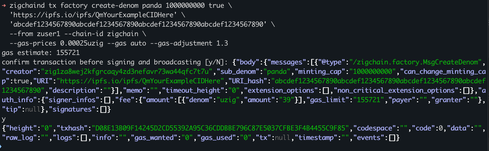

#### Verify Transaction and Query Denom Information

After executing a transaction, you can verify its result and check if the newly created denom is registered.

1. Check a transaction result

Use the transaction hash (txhash) returned from the request to verify the transaction status:

Example:
```sh
TXHASH=D08E13B09F14245D2CD55392A95C36CDDBBE796C87E5037CFBE3F4B4455C9F85
zigchaind q tx $TXHASH
```

2. List all denoms

To confirm that your new denom has been created, query the list of all registered denoms:

```sh
zigchaind q factory list-denom
```

Output example:

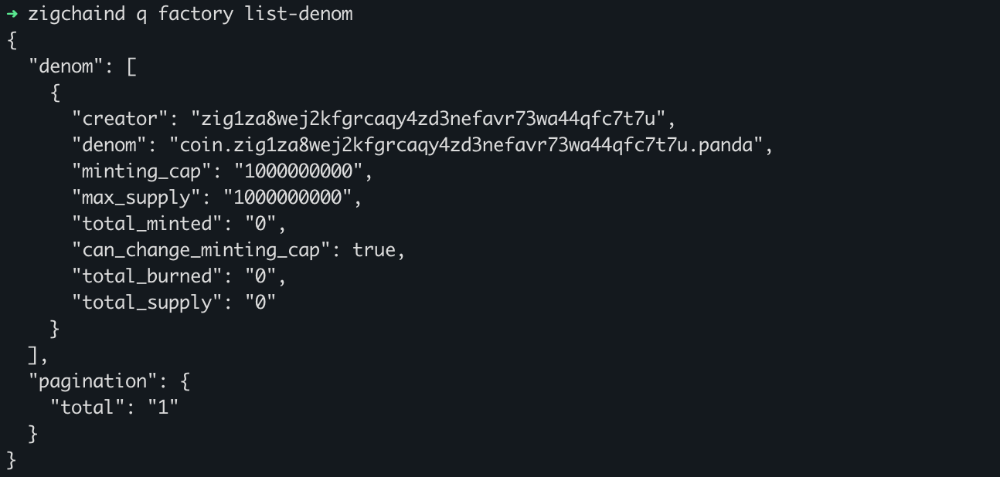

### Get your Denom Information

To retrieve detailed information about a specific token, use the `show-denom` command.

Note --> Use the full token factory address format: `coin.{creator_address}.{subdenom}`.

Usage:
```sh
zigchaind query factory show-denom [denom] [flags]
```

Example:
```sh
zigchaind query factory show-denom coin.zig1za8wej2kfgrcaqy4zd3nefavr73wa44qfc7t7u.panda
```

Output example:


### Mint and Send Token

After creating a token, the bank admin can mint new tokens and transfer them to a
recipient address using the `mint-and-send-tokens` command.

Note --> Use the full token factory address format: `coin.{creator_address}.{subdenom}`.

Usage:
```sh
zigchaind tx factory mint-and-send-tokens [amount-token] [recipient-address] [flags]
```

Example:
```sh
zigchaind tx factory mint-and-send-tokens 1000coin.zig1za8wej2kfgrcaqy4zd3nefavr73wa44qfc7t7u.panda \
  zig1za8wej2kfgrcaqy4zd3nefavr73wa44qfc7t7u \
  --from zuser1 --chain-id zigchain \
  --gas-prices 0.25uzig --gas auto --gas-adjustment 1.3
```

This will:
- Mint 1000 tokens of denom `panda`
- Send minted tokens to the specified recipient address (e.g.`zig1fycdqgg5v8wkkl0fc5y8qjlf6wsk4x9jhrvxh2`).
- Requires admin privileges — only bank admin can mint tokens.

Output example:

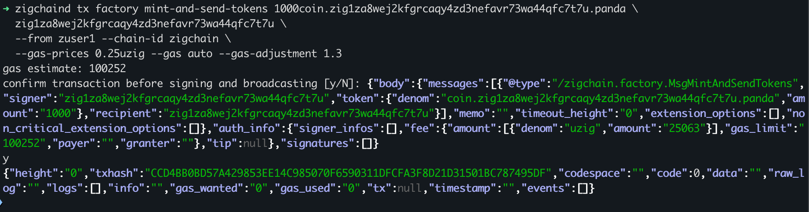

#### Verify Minted Tokens

After minting tokens, check the denom to confirm the supply increased.

Example:
```sh
zigchaind query factory show-denom coin.zig1za8wej2kfgrcaqy4zd3nefavr73wa44qfc7t7u.panda
```

Output example:

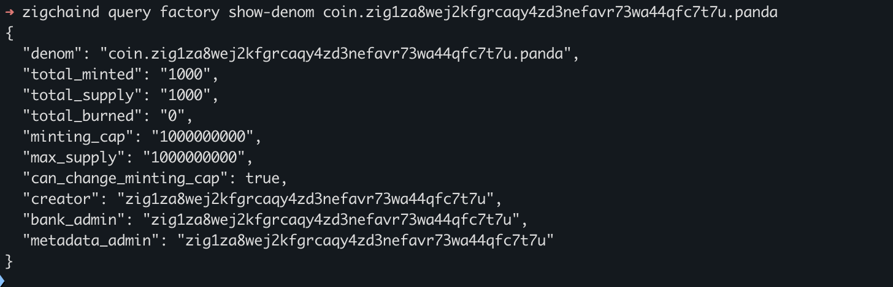

### Burn Token

The `burn-tokens` command allows any token holder to permanently remove tokens from their own account.

Note --> Use the full token factory address format: `coin.{creator_address}.{subdenom}`.

Usage:
```sh
zigchaind tx factory burn-tokens [amount-denom] [flags]
```

Example:
```sh
zigchaind tx factory burn-tokens 200coin.zig1za8wej2kfgrcaqy4zd3nefavr73wa44qfc7t7u.panda \
  --from zuser1 --chain-id zigchain \
  --gas-prices 0.25uzig --gas auto --gas-adjustment 1.5
```

This will:
- Burn 200 tokens of denom `panda` from the signer's account.
- Permanently remove them from circulation.

Output example:

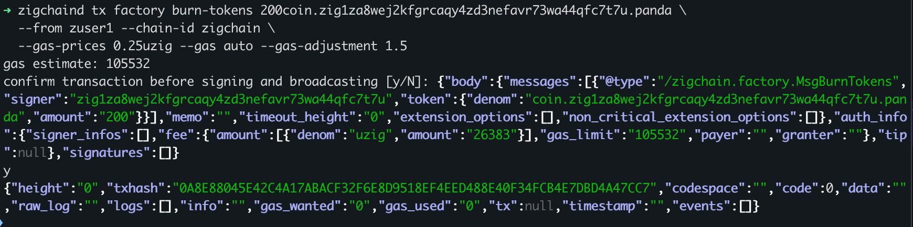

#### Verify Burned Tokens

After burning tokens, check the denom's updated supply to confirm the reduction.

Example:
```sh
zigchaind query factory show-denom coin.zig1za8wej2kfgrcaqy4zd3nefavr73wa44qfc7t7u.panda
```

Output example:

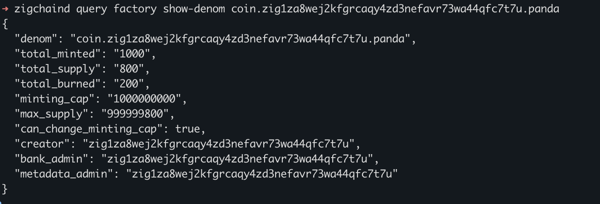

### Get the Denoms List of an Admin

The `denoms-by-admin` command returns all denoms for which the specified admin is assigned as either the bank admin or metadata admin.

Usage:
```sh
zigchaind query factory denoms-by-admin [admin] [flags]
```

Example:
```sh
zigchaind query factory denoms-by-admin zig1za8wej2kfgrcaqy4zd3nefavr73wa44qfc7t7u
```

Output example:

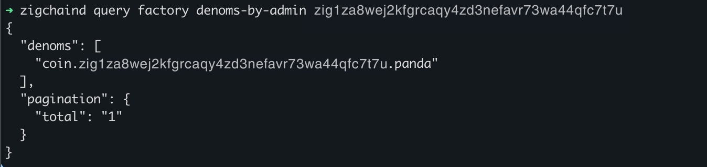

### Set Denom Metadata

The `set-denom-metadata` command allows the bank admin or metadata admin to update a token's metadata.

Usage:
```sh
zigchaind tx factory set-denom-metadata [metadata] [flags]
```

Example:
```sh
zigchaind tx factory set-denom-metadata \
  '{
      "description": "Panda is a sample token designed for demonstration purposes on the ZIGChain.",
      "denom_units": [
        {
          "denom": "coin.zig1za8wej2kfgrcaqy4zd3nefavr73wa44qfc7t7u.panda",
          "exponent": 0
        },
        {
          "denom": "mpanda",
          "exponent": 3
        }
      ],
      "base": "coin.zig1za8wej2kfgrcaqy4zd3nefavr73wa44qfc7t7u.panda",
      "display": "mpanda",
      "name": "panda",
      "symbol": "coin.zig1za8wej2kfgrcaqy4zd3nefavr73wa44qfc7t7u.panda",
      "uri": "ipfs://new_panda_uri_6",
      "uri_hash": "8fd2e4e4ecf24e086aa0d03042005e5fc2a36e0bbea10bf502dd8f18cc22473c"
  }' \
  --from zuser1 --chain-id zigchain \
  --gas-prices 0.25uzig --gas auto --gas-adjustment 1.5
```

Output example:

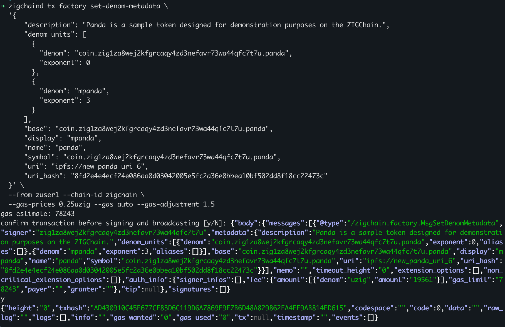

#### Verify Metadata Update

After setting the metadata, check if the changes were applied.

Example:
```sh
zigchaind query bank denom-metadata coin.zig1za8wej2kfgrcaqy4zd3nefavr73wa44qfc7t7u.panda
```

Output example:

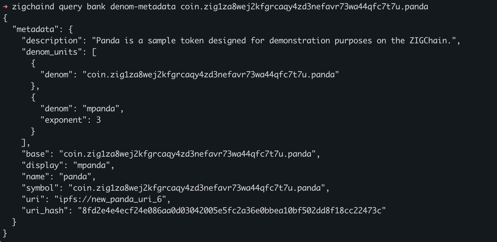

### Update Denom URI and URI Hash

The `update-denom-uri` command allows the bank admin or metadata admin to update a token's metadata URI
and its corresponding SHA-256 hash, while keeping all other metadata unchanged.

Note --> Use the full token factory address format: `coin.{creator_address}.{subdenom}`.

Usage:
```sh
zigchaind tx factory update-denom-uri [denom] [uri] [uri-hash] [flags]
```

Example:
```sh
zigchaind tx factory update-denom-uri coin.zig1za8wej2kfgrcaqy4zd3nefavr73wa44qfc7t7u.panda \
  'ipfs://bafybeieexamplepandametadata_newuri' \
  '2f76f5b8e4d3a2e6f97c247f2d76836964dec629a898852e28cdbf69d9819bbe' \
  --from zuser1 --chain-id zigchain \
  --gas-prices 0.25uzig --gas auto --gas-adjustment 1.5
```

Output example:


#### Verify URI Update

After updating, confirm that the metadata changes have been applied.

Example:
```sh
zigchaind query bank denom-metadata coin.zig1za8wej2kfgrcaqy4zd3nefavr73wa44qfc7t7u.panda
```

Output example:

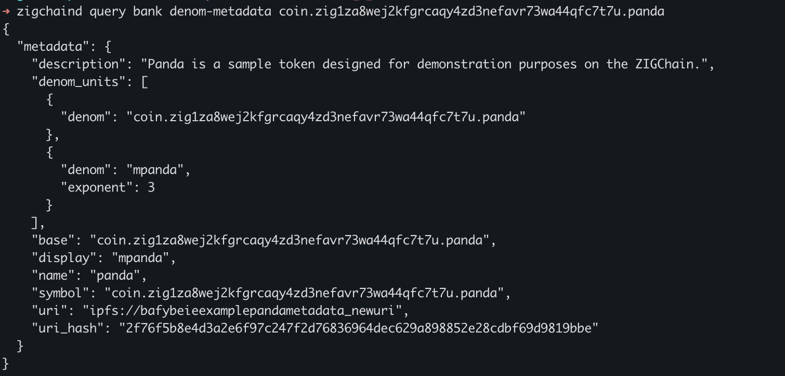

### Update Denom Minting Cap

The `update-denom-minting-cap` command allows the bank admin to increase the minting cap of a token.
It also provides the option to permanently lock future minting cap changes
by setting `can-change-minting-cap` to `false`.

Note --> Use the full token factory address format: `coin.{creator_address}.{subdenom}`.

Usage:
```sh
zigchaind tx factory update-denom-minting-cap [denom] [minting-cap] [can-change-minting-cap] [flags]
```

Example:
```sh
zigchaind tx factory update-denom-minting-cap coin.zig1za8wej2kfgrcaqy4zd3nefavr73wa44qfc7t7u.panda \
  2000000000 true \
  --from zuser1 --chain-id zigchain \
  --gas-prices 0.25uzig --gas auto --gas-adjustment 1.5
```

Output example:

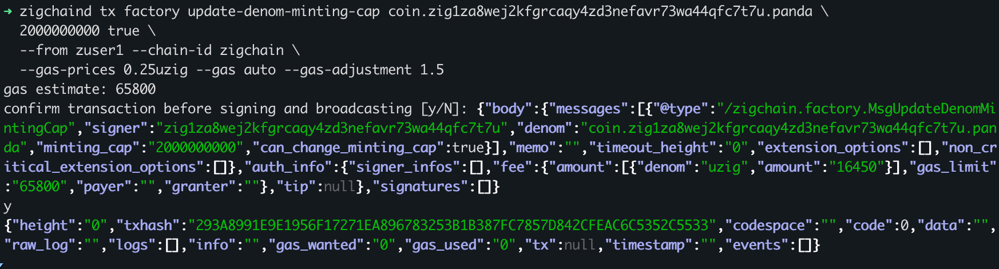

#### Verify Minting Cap Update

After updating, confirm the new minting cap by checking the denom data.

Example:
```sh
zigchaind query factory show-denom coin.zig1za8wej2kfgrcaqy4zd3nefavr73wa44qfc7t7u.panda
```

Output example:


### Get the Denom Admins

The `denom-auth` command allows you to retrieve the bank admin and metadata admin for a specific token.
This helps in identifying who has control over the denom's minting, burning, and metadata updates.

Note --> Use the full token factory address format: `coin.{creator_address}.{subdenom}`.

Usage:
```sh
zigchaind query factory denom-auth [denom] [flags]
```

Example:
```sh
zigchaind query factory denom-auth coin.zig1za8wej2kfgrcaqy4zd3nefavr73wa44qfc7t7u.panda
```

Output example:

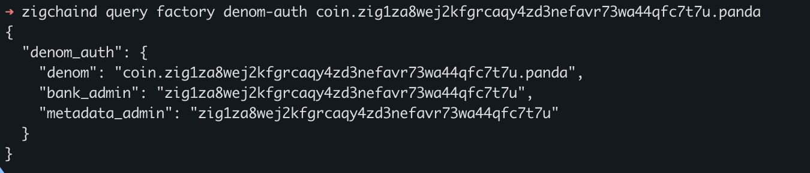

### Propose Denom Admin (Proposes New Bank Admin and/or Metadata Admin)

The `propose-denom-admin` command allows the current bank admin to propose a change to the bank admin and/or metadata 
admin roles for a denom.

Note --> This does not immediately update the admin roles. The proposed new bank admin must later confirm the change by 
running claim-denom-admin.  

Use the full token factory address format: `coin.{creator_address}.{subdenom}`.

Usage:
```sh
zigchaind tx factory propose-denom-admin [denom] [bank-admin-address] [metadata-admin-address] [flags]
```

Example:
```sh
zigchaind tx factory propose-denom-admin coin.zig1za8wej2kfgrcaqy4zd3nefavr73wa44qfc7t7u.panda \
 zig1ep7rjmr88yayyql5mpqxp7mkxdffuawtexlxsw zig1za8wej2kfgrcaqy4zd3nefavr73wa44qfc7t7u \
  --from zuser1 --chain-id zigchain \
  --gas-prices 0.25uzig --gas auto --gas-adjustment 1.5
```

Output example:

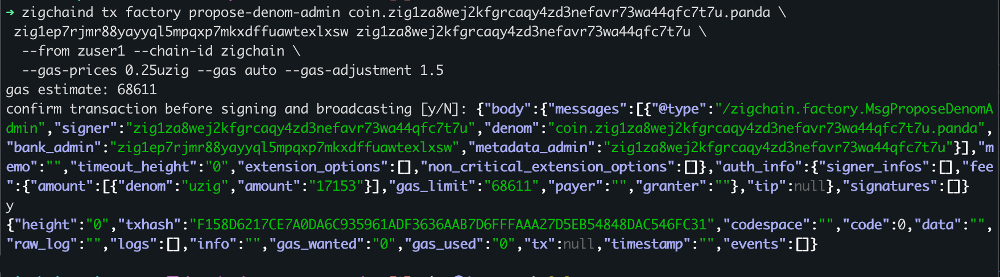

### Claim Denom Admin (Accept the Bank Admin Role)

Once a new bank admin has been proposed using `propose-denom-admin`, the proposed admin must explicitly accept 
the role by executing the `claim-denom-admin` command.

This confirms and finalizes the update to the denom’s admin roles.

Note --> This step must be completed by the new bank admin.  

Usage:
```sh
zigchaind tx factory claim-denom-admin [denom] [flags]
```

Example:
```sh
zigchaind tx factory claim-denom-admin coin.zig1za8wej2kfgrcaqy4zd3nefavr73wa44qfc7t7u.panda \
  --from zuser2 --chain-id zigchain \
  --gas-prices 0.25uzig --gas auto --gas-adjustment 1.5
```

Output example:

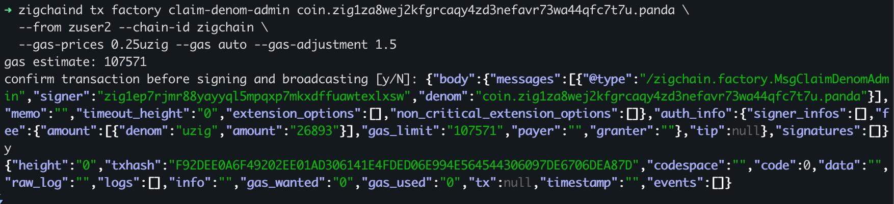

#### Verify Admin Update

After updating, check if the new admin roles have been assigned.

Example:
```sh
zigchaind query factory denom-auth coin.zig1za8wej2kfgrcaqy4zd3nefavr73wa44qfc7t7u.panda
```

Output example:

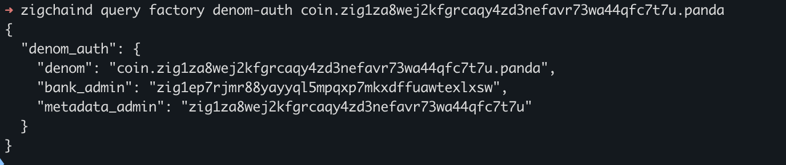

Note: In the following example, the bank admin has been set back to the creator address.

### Update Denom Metadata Auth

The `update-denom-metadata-auth` command allows the current bank admin or metadata admin
to reassign the metadata admin for a specific denom.

Note --> Use the full token factory address format: `coin.{creator_address}.{subdenom}`.

Usage:
```sh
zigchaind tx factory update-denom-metadata-auth [denom] [metadata-admin] [flags]
```

Example:
```sh
zigchaind tx factory update-denom-metadata-auth coin.zig1za8wej2kfgrcaqy4zd3nefavr73wa44qfc7t7u.panda \
  zig1ep7rjmr88yayyql5mpqxp7mkxdffuawtexlxsw \
  --from zuser1 --chain-id zigchain \
  --gas-prices 0.25uzig --gas auto --gas-adjustment 1.5
```

Output example:

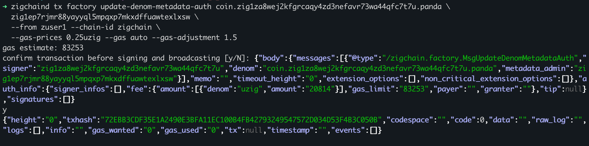

#### Verify Metadata Admin Update

After updating, check if the new metadata admin has been assigned.

Example:
```sh
zigchaind query factory denom-auth coin.zig1za8wej2kfgrcaqy4zd3nefavr73wa44qfc7t7u.panda
```

Output example:

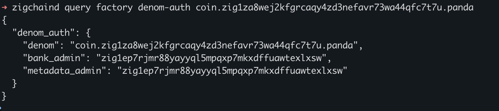

### Get the List of All Denoms Created

The `list-denom` command retrieves all denoms that have been created in the factory module.

The response includes the following:
```json
{
  "denom": [
    {
      "creator": "zig1za8wej2kfgrcaqy4zd3nefavr73wa44qfc7t7u",
      "denom": "coin.zig1za8wej2kfgrcaqy4zd3nefavr73wa44qfc7t7u.panda",
      "minting_cap": "100000000000",
      "max_supply": "99999999750",
      "total_minted": "1000",
      "total_burned": "250",
      "total_supply": "750"
    },
    {
      ...
    }
  ],
  "pagination": {
    "total": "2"
  }
}
```

Example:
```sh
zigchaind query factory list-denom
```

Output example:

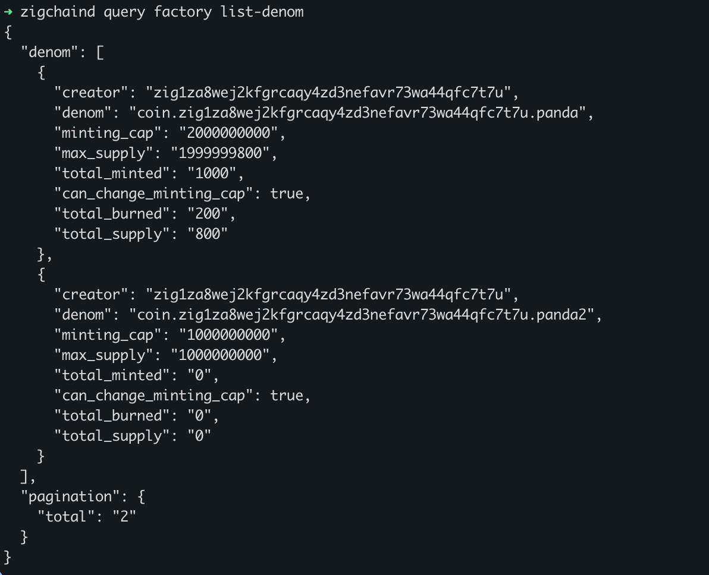

### Get the list of all Denoms Authorities

The `list-denom-auth` command retrieves all denoms along with their admin roles.

The response includes the following:
```json
    {
      "denom": "coin.zig1za8wej2kfgrcaqy4zd3nefavr73wa44qfc7t7u.panda",
      "bankAdmin": "zig1ep7rjmr88yayyql5mpqxp7mkxdffuawtexlxsw",
      "metadataAdmin": "zig1ep7rjmr88yayyql5mpqxp7mkxdffuawtexlxsw"
    }
```

Example:
```sh
zigchaind query factory list-denom-auth
```

Output example:

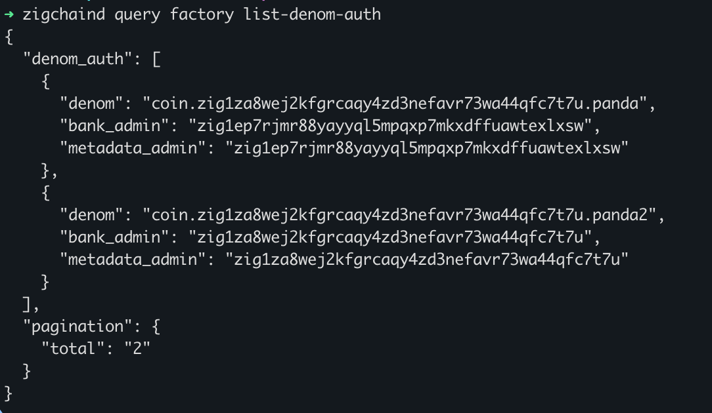

### Withdraw Module Fees

The `withdraw-module-fees` command allows the beneficiary
(if set in params) to withdraw accumulated module fees and transfer
them to a specified recipient.

Usage:
```sh
zigchaind tx factory withdraw-module-fees [receiver] [flags]
```

Example:
```sh
zigchaind tx factory withdraw-module-fees zig1za8wej2kfgrcaqy4zd3nefavr73wa44qfc7t7u \
  --from zuser1 --chain-id zigchain \
  --gas-prices 0.25uzig --gas auto --gas-adjustment 1.5
```

### Get the Factory Params

The `params` command retrieves the current parameters settings of the factory module.

Example:
```sh
zigchaind query factory params
```

Output example:

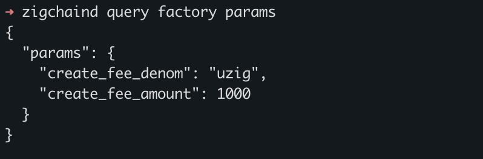

Note --> Factory parameters can only be updated through governance.
To modify these parameters, a governance proposal must be submitted and approved.
Check the [Governance Article](module_governance.md) for more details.
