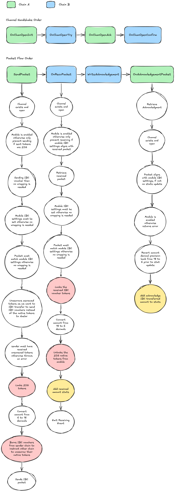

# Token Wrapper Module

The Token Wrapper module is a crucial part of the ZIGChain blockchain that facilitates the bridging between Axelar ZIG tokens (originating from ERC20 ZIG tokens) and native ZIG tokens through IBC (Inter-Blockchain Communication).

## Purpose

The module serves as a bridge between Axelar and ZIGChain, enabling seamless token transfers between ERC20 ZIG tokens on Ethereum and native ZIG tokens on ZIGChain via Axelar, while maintaining proper token wrapping and unwrapping mechanisms.

## Core Functionality

### 1. IBC Token Bridging

- When IBC transfers occur from Axelar to ZIGChain:
  - IBC vouchers are locked within the module wallet
  - The module releases an equivalent amount of native ZIG tokens to the ZIGChain recipient address
  - Token amounts are scaled down from Axelar's 18 decimal precision to ZIGChain's 6 decimal precision
  - **Minimum Transfer Threshold**: Due to the decimal conversion (division by 10^12), transfers that would result in less than 1 native ZIG token (after conversion) are rejected. This is because the division rounds down, and amounts less than the conversion factor would result in zero tokens.

- When native ZIG tokens are sent via IBC to an Axelar address:
  - Native tokens are locked in the module wallet
  - IBC vouchers are released and sent to the Axelar recipient address
  - Token amounts are scaled up from ZIGChain's 6 decimal precision to Axelar's 18 decimal precision

### 2. IBC Escrow and Voucher Mechanism

The module implements the IBC fungible token transfer protocol (ICS-20) with specific handling of escrow and voucher mechanisms:

#### Escrow Mechanism
- When tokens are sent from Axelar to ZIGChain:
  - The source chain (Axelar) escrows the original tokens in a special escrow account
  - The escrow account is derived from the IBC channel and port identifiers
  - This ensures tokens cannot be double-spent while in transit
  - The escrow is released only when the transfer is acknowledged or timed out

#### Voucher Burning
- When tokens are sent back to Axelar:
  - The IBC vouchers on ZIGChain are burned (destroyed)
  - This burning action signals the source chain (Axelar) to release the escrowed tokens
  - The burning mechanism ensures the total supply remains constant across chains
  - This follows the ICS-20 specification for maintaining token fungibility

**Key Mechanism: Burning and Unescrowing**
- Burning IBC vouchers on ZIGChain is directly tied to the IBC packet that instructs Axelar to unescrow the original tokens
```go
im.keeper.BurnIbcTokens(ctx, ibcCoins)
```
- These operations are atomic - both must succeed or both fail
- The IBC packet contains the information needed to release the correct amount of escrowed tokens
```go
im.unescrowToken(ctx, escrowAddress, sender, nativeCoins[0])
```

For more details on the IBC fungible token transfer protocol, refer to the [ICS-20 specification](https://github.com/cosmos/ibc/blob/main/spec/app/ics-020-fungible-token-transfer/README.md#packet-relay).

### 3. IBC Middleware Integration

The module implements IBC middleware hooks:
- `OnRecvPacket`: Handles incoming IBC packets and manages token wrapping
- `SendPacket`: Manages outgoing IBC packets and handles token unwrapping

Here is a more detailed diagram of the IBC middleware integration:



### 4. Operator Controls

An operator address has the following capabilities:
- Set IBC native and counterparty port, channel, and denom for Axelar-ZIGChain communication
- Configure the `decimal_difference` parameter to manage token scaling between chains
- Enable/disable the module in case of IBC channel anomalies
- Fund the module wallet with native ZIG tokens
- Withdraw excess tokens from the module wallet
- Manage pauser addresses (add/remove)

## Governance and Operator Roles

The module implements a dual-role system for managing module parameters and operations:

### Governance Role
- The module includes a standard governance interface (`MsgUpdateParams`) that follows the Cosmos SDK pattern
- The governance authority (typically the x/gov module account) has permission to update module parameters
- Currently, the `Params` struct is empty as all operational parameters are managed through the operator role
- This design maintains compatibility with the Cosmos SDK governance pattern while allowing for future parameter additions

### Operator Role

The operator role has direct control over operational parameters through dedicated message types:

#### Operator Transfer Process

The operator transfer process is a two-step operation to ensure security:

1. **Propose Operator Address**:
   - Only the current operator can propose a new operator address
   - The proposed operator address is stored in state
   - The current operator retains their role and can still:
     - Perform all operator operations
     - Propose a different operator address (overwriting the previous proposal)
   - This step can be executed using the `ProposeOperatorAddress` message

2. **Claim Operator Address**:
   - Only the proposed operator can claim the role
   - The role is transferred to the new operator
   - The proposed operator address is cleared from state
   - The previous operator loses their privileges
   - This step can be executed using the `ClaimOperatorAddress` message

#### Pauser Management

The module implements a pauser role system for emergency control:

1. **Pauser Capabilities**:
   - Pausers can only execute the `MsgDisableTokenWrapper` message
   - This allows them to disable the token wrapper functionality in emergency situations
   - Multiple pauser addresses can be set simultaneously

2. **Pauser Management**:
   - Only the operator can add or remove pauser addresses
   - The operator can manage multiple pauser addresses
   - This provides a distributed emergency control mechanism
   - Pausers can be added or removed at any time by the operator

3. **Use Cases**:
   - Emergency response to security incidents
   - Temporary suspension of token wrapping functionality
   - Distributed control over critical module functions

#### Other Operator Controls

- `MsgEnableTokenWrapper`: Enable the token wrapper functionality
- `MsgDisableTokenWrapper`: Disable the token wrapper functionality
- `MsgUpdateIbcSettings`: Update IBC-related parameters (client IDs, ports, channels, etc.)
- `MsgFundModuleWallet`: Fund the module wallet with native tokens
- `MsgWithdrawFromModuleWallet`: Withdraw excess tokens from the module wallet
- `MsgAddPauserAddress`: Add a new pauser address
- `MsgRemovePauserAddress`: Remove a pauser address
- `MsgProposeOperatorAddress`: Propose a new operator 

This separation of concerns allows for:
1. Governance control over high-level module parameters (when needed)
2. Efficient operational management through the operator role
3. Clear distinction between governance-level and operational-level changes
4. Emergency control through distributed pauser addresses

## Module Wallet Management

The module wallet requires sufficient balances of:
- Native ZIG tokens
- IBC vouchers

To maintain proper bridging functionality, the operator can:
- Fund the module wallet with native ZIG tokens
- Withdraw excess tokens when necessary
- Monitor wallet balances and token flows

## Features

### Add Pauser Address

Through the `MsgAddPauserAddress`, the Token Wrapper Operator can whitelist an address to pause the Token Wrapper.

**Inputs:**
- `new_pauser`: new pauser address (e.g. zig1umu42jmf3ln3f32d0zxpj5gngnw6422w72ma7m).

**Verifications:**
1. Check that signer is the Token Wrapper Operator
2. Check that new_pauser address provided is valid

**State updates:**
1. Add the new pauser address to the list of pauser addresses

Once the address is added, the [pauser_address_added event](#event-pauser_address_added) is emitted.

#### Message: MsgAddPauserAddress

```go
// MsgAddPauserAddress represents a message to add a new pauser address
message MsgAddPauserAddress {
    option (cosmos.msg.v1.signer) = "signer";
    option (amino.name) = "zigchain/x/tokenwrapper/MsgAddPauserAddress";
    
    string signer = 1;
    string new_pauser = 2;
}
```

#### Response Message: MsgAddPauserAddressResponse

```go
message MsgAddPauserAddressResponse {
    string signer = 1 [ (cosmos_proto.scalar) = "cosmos.AddressString" ];
    repeated string pauser_addresses = 6
    [ (cosmos_proto.scalar) = "cosmos.AddressString" ];
}
```

#### Event: pauser_address_added

Example of the `pauser_address_added` event emitted when a new pauser address is added:

```json
{
    "attributes" : [
        {
            "index" : true,
            "key" : "pauser_address",
            "value" : "zig1umu42jmf3ln3f32d0zxpj5gngnw6422w72ma7m"
        },
        {
            "index" : true,
            "key" : "msg_index",
            "value" : "0"
        }
    ],
    "type" : "pauser_address_added"
}
```

### Claim Operator Address

Through the `MsgClaimOperatorAddress`, the new proposed operator gets the Token Wrapper Operator Role. This is the second step in the Token Wrapper Operator transfer process.

**Inputs:**
None

**Verifications:**
1. Check that there is an address proposed as new operator.
2. Check that the signer address matches the proposed operator address.

**State updates:**
1. Update the Token Wrapper Operator Address to the new proposed operator.
2. Clear the proposed operator address

Once the Token Wrapper Operator address is updated, the [operator_address_claimed event](#event-operator_address_claimed) is emitted.

#### Message: MsgClaimOperatorAddress

```go
// MsgClaimOperatorAddress represents a message to claim the operator role
message MsgClaimOperatorAddress {
    option (cosmos.msg.v1.signer) = "signer";
    option (amino.name) = "zigchain/x/tokenwrapper/MsgClaimOperatorAddress";
    
    string signer = 1 [ (cosmos_proto.scalar) = "cosmos.AddressString" ];
}
```

#### Response Message: MsgClaimOperatorAddressResponse

```go
message MsgClaimOperatorAddressResponse {
string signer = 1 [ (cosmos_proto.scalar) = "cosmos.AddressString" ];
string operator_address = 2
[ (cosmos_proto.scalar) = "cosmos.AddressString" ];
}
```

#### Event: operator_address_claimed

Example of the `operator_address_claimed` event emitted when the new operator claims the role:

```json
{
    "attributes" : [
        {
            "index" : true,
            "key" : "old_operator",
            "value" : "zig1umu42jmf3ln3f32d0zxpj5gngnw6422w72ma7m"
        },
        {
            "index" : true,
            "key" : "new_operator",
            "value" : "zig1d7j35kdlwchfa8ch0f9f52vteh0hxwx0etxwjw"
        },
        {
            "index" : true,
            "key" : "msg_index",
            "value" : "0"
        }
    ],
    "type" : "operator_address_claimed"
}
```

### Disable Token Wrapper

Through the `MsgDisableTokenWrapper`, the Token Wrapper operator or any of the pauser addresses can stop the Token Wrapper Module.

**Inputs:**
None

**Verifications:**
1. Check that the signer is either the Token Wrapper operator or one of the pauser addresses.

**State updates:**
1. Change the status of the Token Wrapper to Pause / Disable.

While the token wrapper is disabled the transfers matching the settings will not be effective. Once the Token Wrapper is set up as disabled, the [tokenwrapper_disabled event](#event-tokenwrapper_disabled) is emitted.

#### Message: MsgDisableTokenWrapper

```go
// MsgDisableTokenWrapper represents a message to disable the token wrapper
// functionality
message MsgDisableTokenWrapper {
    option (cosmos.msg.v1.signer) = "signer";
    option (amino.name) = "zigchain/x/tokenwrapper/MsgDisableTokenWrapper";
    
    string signer = 1 [ (cosmos_proto.scalar) = "cosmos.AddressString" ];
}
```

#### Response Message: MsgDisableTokenWrapperResponse

```go
message MsgDisableTokenWrapperResponse {
    string signer = 1 [ (cosmos_proto.scalar) = "cosmos.AddressString" ];
    bool enabled = 2;
}
```

#### Event: tokenwrapper_disabled

Example of the `tokenwrapper_disabled` event emitted when the token wrapper is disabled:

```json
{
    "attributes" : [
        {
            "index" : true,
            "key" : "signer",
            "value" : "zig1umu42jmf3ln3f32d0zxpj5gngnw6422w72ma7m"
        },
        {
            "index" : true,
            "key" : "msg_index",
            "value" : "0"
        }
    ],
    "type" : "tokenwrapper_disabled"
}
```

### Enable Token Wrapper

Through the `MsgEnableTokenWrapper`, the Token Wrapper operator can unpause or enable the Token Wrapper Module.

**Inputs:**
None

**Verifications:**
1. Check that the signer is the Token Wrapper operator.

**State updates:**
1. Change the status of the Token Wrapper to Unpause / Enable.

Once the Token Wrapper is set up as enabled, the [tokenwrapper_enabled event](#event-tokenwrapper_enabled) is emitted.

#### Message: MsgEnableTokenWrapper

```go
// MsgEnableTokenWrapper represents a message to enable the token wrapper
// functionality
message MsgEnableTokenWrapper {
    option (cosmos.msg.v1.signer) = "signer";
    option (amino.name) = "zigchain/x/tokenwrapper/MsgEnableTokenWrapper";
    
    string signer = 1 [ (cosmos_proto.scalar) = "cosmos.AddressString" ];
}
```

#### Response Message: MsgEnableTokenWrapperResponse

```go
message MsgEnableTokenWrapperResponse {
    string signer = 1 [ (cosmos_proto.scalar) = "cosmos.AddressString" ];
    bool enabled = 2;
}
```

#### Event: tokenwrapper_enabled

Example of the `tokenwrapper_enabled` event emitted when the token wrapper is enabled:

```json
{
    "attributes" : [
        {
            "index" : true,
            "key" : "signer",
            "value" : "zig1umu42jmf3ln3f32d0zxpj5gngnw6422w72ma7m"
        },
        {
            "index" : true,
            "key" : "msg_index",
            "value" : "0"
        }
    ],
    "type" : "tokenwrapper_enabled"
}
```

### Fund Module Wallet

Through the `MsgFundModuleWallet`, the Token Wrapper operator can add funds to the Token Wrapper Module address.

**Inputs:**
- `amount`: amount and token name (e.g. 1000uzig)

**Verifications:**
1. Check that the signer is the Token Wrapper operator.
2. Ensure that the Token Wrapper operator has the amount.

**State updates:**
1. Transfer the funds from the Token Wrapper operator to the Module wallet.

Once the funds are sent, the [module_wallet_funded event](#event-module_wallet_funded) is emitted.

#### Message: MsgFundModuleWallet

```go
message MsgFundModuleWallet {
    option (cosmos.msg.v1.signer) = "signer";
    option (amino.name) = "zigchain/x/tokenwrapper/MsgFundModuleWallet";
    
    string signer = 1 [ (cosmos_proto.scalar) = "cosmos.AddressString" ];
    repeated cosmos.base.v1beta1.Coin amount = 2 [ (gogoproto.nullable) = false ];
}
```

#### Response Message: MsgFundModuleWalletResponse

```go
message MsgFundModuleWalletResponse {
    string signer = 1 [ (cosmos_proto.scalar) = "cosmos.AddressString" ];
    repeated cosmos.base.v1beta1.Coin amount = 2 [ (gogoproto.nullable) = false ];
    repeated cosmos.base.v1beta1.Coin balances = 3 [ (gogoproto.nullable) = false ];
    string module_address = 4 [ (cosmos_proto.scalar) = "cosmos.AddressString" ];
}
```

#### Event: module_wallet_funded

Example of the `module_wallet_funded` event emitted when the module wallet is funded:

```json
{
    "attributes" : [
        {
            "index" : true,
            "key" : "signer",
            "value" : "zig1umu42jmf3ln3f32d0zxpj5gngnw6422w72ma7m"
        },
        {
            "index" : true,
            "key" : "module_address",
            "value" : "zig1hdq87rzf327fwz8rw9rnmchj7qa3uxrpxds2ff"
        },
        {
            "index" : true,
            "key" : "amount",
            "value" : "1000uzig"
        },
        {
            "index" : true,
            "key" : "balances",
            "value" : "1000uzig"
        },
        {
            "index" : true,
            "key" : "msg_index",
            "value" : "0"
        }
    ],
    "type" : "module_wallet_funded"
}
```

### Propose Operator Address

Through the `MsgProposeOperatorAddress`, the current Token Wrapper operator can propose a new address to be the new Token Wrapper operator. This is the first step in the Token Wrapper Operator transfer process.

**Inputs:**
- `new_operator`: proposed operator address (e.g. zig1umu42jmf3ln3f32d0zxpj5gngnw6422w72ma7m).

**Verifications:**
1. Check that the signer is the current operator.
2. Check that the new proposed address is valid.
3. Check that the new proposed address is not the current operator address.

**State updates:**
1. Store the new proposed operator address.

Once the new operator address is stored, the [operator_address_proposed event](#event-operator_address_proposed) is emitted.

#### Message: MsgProposeOperatorAddress

```go
// MsgProposeOperatorAddress represents a message to propose a new operator
// address
message MsgProposeOperatorAddress {
    option (cosmos.msg.v1.signer) = "signer";
    option (amino.name) = "zigchain/x/tokenwrapper/MsgProposeOperatorAddress";
    
    string signer = 1 [ (cosmos_proto.scalar) = "cosmos.AddressString" ];
    string new_operator = 2 [ (cosmos_proto.scalar) = "cosmos.AddressString" ];
}
```

#### Response Message:

```go
message MsgProposeOperatorAddressResponse {
    string signer                    = 1 [ (cosmos_proto.scalar) = "cosmos.AddressString" ];
    string proposed_operator_address = 2 [ (cosmos_proto.scalar) = "cosmos.AddressString" ];
}
```

#### Event: operator_address_proposed

Example of the `operator_address_proposed` event emitted when a new operator address is proposed:

```json
{
    "attributes" : [
        {
            "index" : true,
            "key" : "old_operator",
            "value" : "zig15yk64u7zc9g9k2yr2wmzeva5qgwxps6y8c2amk"
        },
        {
            "index" : true,
            "key" : "new_operator",
            "value" : "zig1umu42jmf3ln3f32d0zxpj5gngnw6422w72ma7m"
        },
        {
            "index" : true,
            "key" : "msg_index",
            "value" : "0"
        }
    ],
    "type" : "operator_address_proposed"
}
```

### Remove Pauser Address

Through the `MsgRemovePauserAddress`, the Token Wrapper Operator can remove an address from the list of addresses with pause privileges.

**Inputs:**
- `pauser`: pauser address to be removed (e.g. zig1umu42jmf3ln3f32d0zxpj5gngnw6422w72ma7m).

**Verifications:**
1. Check that signer is the Token Wrapper Operator
2. Check that pauser address provided is valid

**State updates:**
1. Remove the pauser address from the list of whitelisted pauser addresses

Once the address is removed, the [pauser_address_removed event](#event-pauser_address_removed) is emitted.


#### Message: MsgRemovePauserAddress

```go
// MsgRemovePauserAddress represents a message to remove a pauser address
message MsgRemovePauserAddress {
    option (cosmos.msg.v1.signer) = "signer";
    option (amino.name) = "zigchain/x/tokenwrapper/MsgRemovePauserAddress";
    
    string signer = 1;
    string pauser = 2;
}
```

#### Response Message: MsgRemovePauserAddressResponse

```go
message MsgRemovePauserAddressResponse {
    string signer = 1 [ (cosmos_proto.scalar) = "cosmos.AddressString" ];
    repeated string pauser_addresses = 6 [ (cosmos_proto.scalar) = "cosmos.AddressString" ];
}
```

#### Event: pauser_address_removed

Example of the `pauser_address_removed` event emitted when a pauser address is removed:

```json
{
    "attributes" : [
        {
            "index" : true,
            "key" : "pauser_address",
            "value" : "zig1umu42jmf3ln3f32d0zxpj5gngnw6422w72ma7m"
        },
        {
            "index" : true,
            "key" : "msg_index",
            "value" : "0"
        }
    ],
    "type" : "pauser_address_removed"
}
```

### Update IBC Settings

Through the `MsgUpdateIbcSettings`, the Token Wrapper Operator can update the IBC settings that will be considered to wrap an IBC Token.

**Inputs:**
- `native_client_id`: client id of the native chain, ZIGChain in this case (e.g. "07-tendermint-0").
- `counterparty_client_id`: client id of the connected IBC chain (e.g. "07-tendermint-1").
- `native_port`: IBC port of the IBC connection for the native chain, ZIGChain in this case (e.g. "transfer").
- `counterparty_port`: IBC port of the IBC connection for the counterparty chain (e.g. "transfer").
- `native_channel`: IBC channel of the IBC connection for the native chain, ZIGChain in this case (e.g. "channel-0").
- `counterparty_channel`: IBC channel of the IBC connection for the counterparty chain (e.g. "channel-1").
- `denom`: Token name 
- `decimal_difference`: number of decimals positions difference between the token native chain and the counterparty chain (e.g. 12) 

**Verifications:**
1. Check that signer is the Token Wrapper Operator

**State updates:**
1. Update the Parameters in the Token Wrapper Module with the parameters provided.

Once the parameters are updated, the [ibc_settings_updated event](#event-ibc_settings_updated) is emitted.

#### Message: MsgUpdateIbcSettings

```go
message MsgUpdateIbcSettings {
    option (cosmos.msg.v1.signer) = "signer";
    option (amino.name) = "zigchain/x/tokenwrapper/MsgUpdateIbcSettings";
    
    string signer = 1 [ (cosmos_proto.scalar) = "cosmos.AddressString" ];
    string native_client_id = 2;
    string counterparty_client_id = 3;
    string native_port = 4;
    string counterparty_port = 5;
    string native_channel = 6;
    string counterparty_channel = 7;
    string denom = 8;
    uint32 decimal_difference = 9;
}
```

#### Response Message: MsgUpdateIbcSettingsResponse

```go
message MsgUpdateIbcSettingsResponse {
    string signer = 1 [ (cosmos_proto.scalar) = "cosmos.AddressString" ];
    string native_client_id = 2;
    string counterparty_client_id = 3;
    string native_port = 4;
    string counterparty_port = 5;
    string native_channel = 6;
    string counterparty_channel = 7;
    string denom = 8;
    uint32 decimal_difference = 9;
}
```

#### Event: ibc_settings_updated

```json
{
    "attributes" : [
        {
            "index" : true,
            "key" : "signer",
            "value" : "zig1umu42jmf3ln3f32d0zxpj5gngnw6422w72ma7m"
        },
        {
            "index" : true,
            "key" : "native_client_id",
            "value" : "07-tendermint-99"
        },
        {
            "index" : true,
            "key" : "counterparty_client_id",
            "value" : "07-tendermint-100"
        },
        {
            "index" : true,
            "key" : "native_port",
            "value" : "transfer"
        },
        {
            "index" : true,
            "key" : "counterparty_port",
            "value" : "transfer"
        },
        {
            "index" : true,
            "key" : "native_channel",
            "value" : "channel-90"
        },
        {
            "index" : true,
            "key" : "counterparty_channel",
            "value" : "channel-91"
        },
        {
            "index" : true,
            "key" : "denom",
            "value" : "denom-zig"
        },
        {
            "index" : true,
            "key" : "decimal_difference",
            "value" : "14"
        },
        {
            "index" : true,
            "key" : "msg_index",
            "value" : "0"
        }
    ],
    "type" : "ibc_settings_updated"
}
```

### Withdraw From Module Wallet

Through the `MsgWithdrawFromModuleWallet`, the Token Wrapper Operator can withdraw funds from the Token Wrapper Module address and receive them in its wallet. This is mechanism to reduce the risk of having too many funds in one single wallet.

**Inputs:**
- `amount`: amount and token name (e.g. 1000uzig)

**Verifications:**
1. Check that the signer is the Token Wrapper operator.
2. Ensure that the Token Wrapper Module has the amount.

**State updates:**
1. Transfer the funds from the Token Wrapper Module to the Operator wallet.

Once the funds are sent, the [module_wallet_withdrawn event](#event-module_wallet_withdrawn) is emitted.

#### Message: MsgWithdrawFromModuleWallet

```go
message MsgWithdrawFromModuleWallet {
option (cosmos.msg.v1.signer) = "signer";
option (amino.name) = "zigchain/x/tokenwrapper/MsgWithdrawFromModuleWallet";

string signer = 1 [ (cosmos_proto.scalar) = "cosmos.AddressString" ];
repeated cosmos.base.v1beta1.Coin amount = 2 [ (gogoproto.nullable) = false ];
}
```

#### Response Message: MsgWithdrawFromModuleWalletResponse

```go
message MsgWithdrawFromModuleWalletResponse {
    string signer = 1 [ (cosmos_proto.scalar) = "cosmos.AddressString" ];
    repeated cosmos.base.v1beta1.Coin amount = 2 [ (gogoproto.nullable) = false ];
    repeated cosmos.base.v1beta1.Coin balances = 3 [ (gogoproto.nullable) = false ];
    string module_address = 4 [ (cosmos_proto.scalar) = "cosmos.AddressString" ];
    string receiver = 5 [ (cosmos_proto.scalar) = "cosmos.AddressString" ];
}
```

#### Event: module_wallet_withdrawn

Example of the `module_wallet_withdrawn` event emitted when the module wallet is withdrawn:

```json
{
    "attributes" : [
        {
            "index" : true,
            "key" : "signer",
            "value" : "zig1umu42jmf3ln3f32d0zxpj5gngnw6422w72ma7m"
        },
        {
            "index" : true,
            "key" : "module_address",
            "value" : "zig1hdq87rzf327fwz8rw9rnmchj7qa3uxrpxds2ff"
        },
        {
            "index" : true,
            "key" : "amount",
            "value" : "1ibc/B6863C1B541063B17C757293EC2E45BD2984AAC8CADD5ED7EDC2DA58B99445DC"
        },
        {
            "index" : true,
            "key" : "balances",
            "value" : "999999999999ibc/B6863C1B541063B17C757293EC2E45BD2984AAC8CADD5ED7EDC2DA58B99445DC,999uzig"
        },
        {
            "index" : true,
            "key" : "msg_index",
            "value" : "0"
        }
    ],
    "type" : "module_wallet_withdrawn"
}
```

### Recover ZIG

The `MsgRecoverZig` functionality provides a recovery mechanism for failed ZIG token bridging operations. This feature allows users to recover their native ZIG tokens when the bridging process from EVM (Ethereum or Sepolia) fails to complete properly.

#### When Recovery is Needed

The recovery process becomes necessary in the following scenarios:

- **Insufficient Module Wallet Balance**: The TokenWrapper module wallet doesn't have enough native ZIG tokens to fulfill the bridging request
- **IBC Settings Mismatch**: The received IBC vouchers don't match the configured IBC settings for proper token wrapping
- **Module Disabled**: The TokenWrapper module is temporarily disabled due to maintenance, security concerns, or emergency situations
- **Decimal Precision Scaling**: When bridging ZIG ERC20 tokens from EVM chains (18 decimal precision) to ZIGChain (6 decimal precision), small amounts may result in zero native ZIG tokens after scaling down. In this case, IBC vouchers are still released to the receiver address and can be recovered later using `MsgRecoverZig` when accumulated vouchers reach a sufficient amount to produce a positive native ZIG balance after decimal scaling

In these cases, users receive IBC vouchers in their ZIGChain address instead of the expected native ZIG tokens, requiring manual intervention to complete the conversion.

#### Permission-Less Recovery

The `MsgRecoverZig` message is designed to be **permission-less**, meaning anyone can trigger the recovery process on behalf of any address that holds IBC vouchers requiring conversion. This design provides several important benefits:

1. **Automated Recovery**: Enables automated systems to monitor and recover stuck tokens without requiring user intervention
2. **Reduced End-User Friction**: Users don't need to hold native ZIG tokens for gas payment to initiate recovery
3. **Enhanced User Experience**: Prevents users from being blocked or frustrated by failed bridging operations

#### Recovery Process

**Inputs:**
- `signer`: The address initiating the recovery (can be any valid address)
- `address`: The target address holding the IBC vouchers to be recovered

**Verifications:**
1. Check that the signer address is valid
2. Check that the target address is valid
3. Verify that the target address holds IBC vouchers that match the configured IBC settings
4. Ensure the module wallet has sufficient native ZIG tokens for the conversion

**State updates:**
1. Lock the IBC vouchers from the target address
2. Transfer the corresponding amount of native ZIG tokens (adjusted for the decimal difference) from the module wallet to the target address

Once the recovery is completed, the [address_zig_recovered event](#event-address_zig_recovered) is emitted.

#### Message: MsgRecoverZig

```go
message MsgRecoverZig {
  option (cosmos.msg.v1.signer) = "signer";
  string signer = 1;
  string address = 2;
}
```

#### Response Message: MsgRecoverZigResponse

```go
message MsgRecoverZigResponse {
  string signer = 1 [ (cosmos_proto.scalar) = "cosmos.AddressString" ];
  string receiving_address = 2
      [ (cosmos_proto.scalar) = "cosmos.AddressString" ];
  cosmos.base.v1beta1.Coin locked_ibc_amount = 3
      [ (gogoproto.nullable) = false ];
  cosmos.base.v1beta1.Coin unlocked_native_amount = 4
      [ (gogoproto.nullable) = false ];
}
```

#### Event: address_zig_recovered

Example of the `address_zig_recovered` event emitted when ZIG tokens are successfully recovered:

```json
{
    "attributes" : [
        {
            "index" : true,
            "key" : "signer",
            "value" : "zig1umu42jmf3ln3f32d0zxpj5gngnw6422w72ma7m"
        },
        {
            "index" : true,
            "key" : "address",
            "value" : "zig1umu42jmf3ln3f32d0zxpj5gngnw6422w72ma7m"
        },
        {
            "index" : true,
            "key" : "locked_ibc_amount",
            "value" : "1000000000000000000ibc/B6863C1B541063B17C757293EC2E45BD2984AAC8CADD5ED7EDC2DA58B99445DC"
        },
        {
            "index" : true,
            "key" : "unlocked_native_amount",
            "value" : "1000000uzig"
        },
        {
            "index" : true,
            "key" : "msg_index",
            "value" : "0"
        }
    ],
    "type" : "address_zig_recovered"
}
```

## Error Handling

The module includes comprehensive error handling for:
- Invalid IBC packets
- Insufficient module wallet balances
- Invalid operator actions
- Module state inconsistencies
- IBC channel anomalies 

## Testing

A comprehensive test script (`setup_localnet.sh`) is available to test all module functionalities. The script:

1. Sets up 3 test chains (Axelar, Dummy and ZIGChain)
2. Configures 2 IBC relayers between the chains
3. Tests token transfers in both directions between the chains
4. Verifies proper token wrapping/unwrapping
5. Validates module wallet management
6. Checks operator controls and parameter settings

To run the tests:
```bash
bash x/tokenwrapper/sh/setup_localnet.sh
```

The script will:
- Create test chains with initial balances
- Configure IBC channels
- Perform test transfers
- Verify all module functionalities
- Clean up test environment

The script will result in the following output:

```
$ bash sh/setup_localnet.sh  
Starting IBC relayer setup...
Using configuration:
  Axelar Chain ID: axelar
  Zigchain Chain ID: zigchain
  Axelar RPC Port: 26657
  Zigchain RPC Port: 26659
  Zigchain Transfer Amount: 10uzig
  Axelar Transfer Amount: 10000000000000waxlzig
  Module Fund Amount: 1000uzig
  Zigchain Branch: feat/token-wrapper-locks-received-ibc-tokens
Created working directory: /var/folders/xz/fg8ccbhs5yvfg049dnhbvgmc0000gn/T/tmp.qWoODbA7Ak
Generating axelar chain...
```

### Troubleshooting
If you encounter issues during the setup or testing process, consider the following steps:
1. Ensure that both chains are running.
```sh
tail -f $WORK_DIR/logs/axelar.log
```

```sh
tail -f $WORK_DIR/logs/zigchain.log
```

If any of the chains doesn't show the new block heights, check the logs and run them manually following the steps in test script (`setup_ibc_relayer.sh`)

2. Ensure that gRPC endpoints are accessible.

```sh
grpcurl -plaintext localhost:$AXELAR_GRPC_PORT list
```

```sh
grpcurl -plaintext localhost:$ZIGCHAIN_GRPC_PORT list
```

If the grpcurl command returns an error, it means the gRPC endpoint is not accessible. Check with the following commands to see if the ports are used by the correct process or another process
```sh
sudo lsof -i :$AXELAR_GRPC_PORT
sudo netstat -tan | grep -i $AXELAR_GRPC_PORT
```

## Axelar Bridge

The `sepolia_zigtest2_via_axelar.sh` script provides a user-friendly way to transfer tokens between Ethereum's Sepolia testnet and ZIGChain's testnet (`zig-test-2`) using Axelar as a bridge. This script is particularly useful for testing token transfers in a development environment.

### Purpose

The script automates the process of:
1. Generating deposit addresses for token transfers
2. Executing token transfers in both directions
3. Providing clear feedback and logging for each step

### Usage

1. **Environment Setup**
   ```bash
   # Required environment variables
   export ZIG_ADDRESS="your_zig_address"          # Your ZIGChain address
   export EVM_ADDRESS="your_evm_address"          # Your Ethereum address
   export EVM_PRIVATE_KEY="your_evm_private_key"  # Your Ethereum private key
   export ZIG_PRIVATE_KEY="your_zig_private_key"  # Your ZIGChain private key
   ```

2. **Optional Environment Variables**
   ```bash
   # These have default values but can be overridden
   export ETH_RPC_URL="your_rpc_url"              # Default: https://ethereum-sepolia-rpc.publicnode.com
   export DEPOSIT_SERVICE_URL="your_service_url"  # Default: https://deposit-service.testnet.axelar.dev
   export ZIG_RPC_URL="your_zig_rpc_url"          # Default: https://testnet-rpc.zigchain.com
   ```

3. **Running the Script**
   ```bash
   bash x/tokenwrapper/sh/sepolia_zigtest2_via_axelar.sh
   ```

4. **Interactive Choices**
   - Choose transfer direction (Sepolia → zig-test-2 or zig-test-2 → Sepolia)
   - Choose deposit address generation method:
     - Automatic: Script generates the address
     - Manual: Use satellite.money interface with provided URL

### Features

- ✅ Interactive prompts for user choices
- ✅ Clear logging with success/error indicators
- ✅ Support for both automatic and manual deposit address generation
- ✅ Comprehensive error handling
- ✅ Detailed transaction feedback

### Example Output

```
[2024-03-21 10:30:00] ✅ Starting Axelar bridge transfer script...
[2024-03-21 10:30:01] ✅ All required variables are set successfully.
[2024-03-21 10:30:02] ✅ Please choose the transfer direction:
1) Send from Sepolia to zig-test-2
2) Send from zig-test-2 to Sepolia
[2024-03-21 10:30:03] ✅ Generated deposit address: 0x...
[2024-03-21 10:30:04] ✅ Token transfer transaction submitted successfully
```

### Notes

- The script uses Axelar's testnet infrastructure
- Token amounts are fixed at 1 ZIG (with appropriate decimal scaling)
- Always verify the generated deposit addresses before proceeding
- Keep your private keys secure and never share them

### Troubleshooting

If you encounter issues:
1. Verify all required environment variables are set
2. Check your RPC endpoints are accessible
3. Ensure you have sufficient balances on both chains
4. Verify the IBC channel is active and properly configured

## IBCv2 Bridge

The `eth_cosmos_via_ibcv2.sh` script enables direct transfers of ERC20 ZIG tokens from Ethereum mainnet to Cosmos chains using IBCv2 protocol. This script is particularly useful for cross-chain transfers without intermediate bridges.

### Purpose

The script automates the process of:
1. Approving ERC20 token transfers
2. Executing cross-chain transfers via IBCv2
3. Managing relayer fees and timeouts
4. Providing clear feedback and logging for each step

### Usage

1. **Environment Setup**
   ```bash
   # Required environment variables
   export PUBLIC_KEY="your_ethereum_address"        # Your Ethereum public address
   export PRIVATE_KEY="your_ethereum_private_key"  # Your Ethereum private key
   export RECEIVER_ADDRESS="cosmos_address"        # Your Cosmos chain address
   ```

2. **Optional Environment Variables**
   ```bash
   # These have default values but can be overridden
   export RPC_URL="your_rpc_url"                   # Default: https://ethereum-rpc.publicnode.com
   export CONTRACT_ADDRESS="contract_address"      # Default: 0xFc2d0487A0ae42ae7329a80dc269916A9184cF7C
   export AMOUNT="transfer_amount"                 # Default: 526
   export TOKEN_ADDRESS="token_address"            # Default: 0xA0b86991c6218b36c1d19D4a2e9Eb0cE3606eB48
   export SOURCE_CLIENT="client_id"                # Default: cosmoshub-0
   export DEST_PORT="port_id"                      # Default: transfer
   export MEMO="transaction_memo"                  # Default: "Test transaction"
   export RELAYER_FEE="fee_amount"                 # Default: 23474
   export RELAYER_ADDRESS="relayer_address"        # Default: 0x2d574c3f25EFB98df6340E66a778318FE6592E30
   ```

3. **Running the Script**
   ```bash
   bash x/tokenwrapper/sh/eth_cosmos_via_ibcv2.sh
   ```

### Process Flow

1. **Token Approval**
   - Script first approves the contract to spend your ERC20 tokens
   - Verifies the allowance is set correctly

2. **Cross-Chain Transfer**
   - Sends ERC20 tokens to the IBCv2 contract
   - Includes destination chain information
   - Sets appropriate timeouts and relayer fees

3. **Transaction Monitoring**
   - Provides feedback at each step
   - Logs transaction status and details

### Features

- ✅ Automatic token approval
- ✅ Configurable transfer parameters
- ✅ Comprehensive error handling
- ✅ Detailed transaction logging
- ✅ Support for custom relayer fees
- ✅ Configurable timeouts

### Example Output

```
[2024-03-21 10:30:00] ✅ Starting IBCv2 bridge transfer script...
[2024-03-21 10:30:01] ✅ All required variables are set successfully.
[2024-03-21 10:30:02] ✅ Approving ERC20 tokens...
[2024-03-21 10:30:03] ✅ Checking allowance...
[2024-03-21 10:30:04] ✅ Sending ERC20 tokens to Cosmos...
[2024-03-21 10:30:05] ✅ Transaction submitted successfully
```

### Notes

- The script uses IBCv2 protocol for direct chain-to-chain transfers
- Ensure sufficient token balance and ETH for gas fees
- Verify the destination chain supports IBCv2
- Keep your private keys secure and never share them
- The default timeout is set to 2 hours (7200 seconds)

### Troubleshooting

If you encounter issues:
1. Verify all required environment variables are set
2. Check your RPC endpoint is accessible
3. Ensure you have sufficient token balance and ETH for gas
4. Verify the destination chain is properly configured for IBCv2
5. Check the relayer is active and properly configured